# KN01
[Task Description](/task/KN01.pdf)

## Steps
---

## A)
Installation of Multipass 1.11.1 on Windows Pro (no documentation needed)

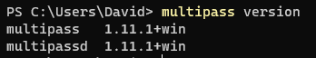

---
## B)
Using the command to find all the available images:

```
multipass find
```

Result:

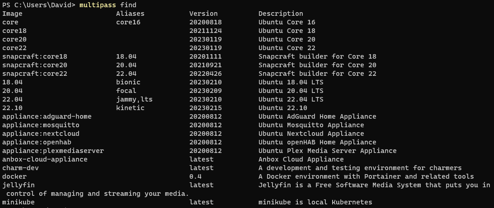

Using the commands to start a Ubuntu 22.04 instance:

```
multipass launch 22.04
```
```
multipass launch jammy
```

The images get started:

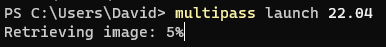

Using the command to list all the instances:

```
multipass list
```

Displays the two started instances:

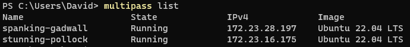

One can also display the running instances over the GUI:


---
## C)

Sarting and stopping the Linux instances via console:

```
multipass stop <name of instance>
```

```
multipass start <name of instance>
```

Here is how the result could look like (in combination with the `list` command):

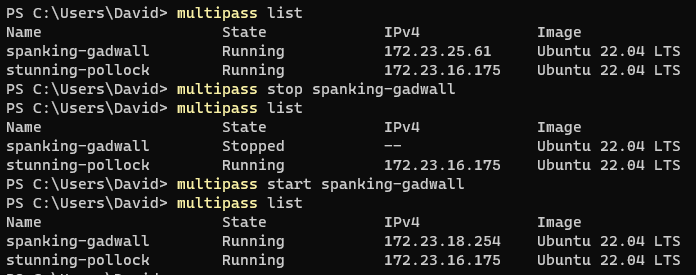

Using the following command to see more detailed information about the instance:

```
multipass info <name of instance>
```

Before altering the instance settings I will need to stop the instance first (see step B).

Now I can increase the CPU to 2 with the following command:

```
multipass set local.<name of instance>.cpus=2
```

The result looks something like this (using the `info` command to see more details):

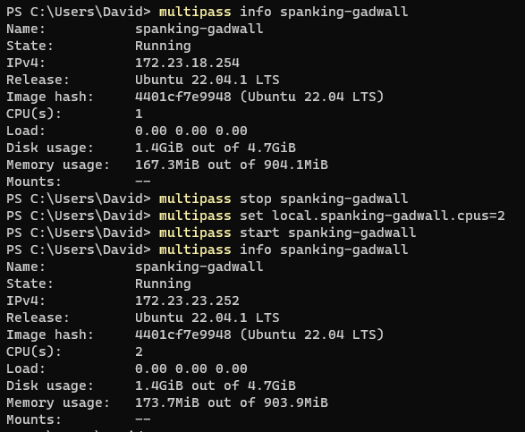

_As you can see in the image above the cpu count has increased to two._

To access the instances shell I can use the following command:

```
multipass shell <name of instance>
```

Here is what the result looks like:

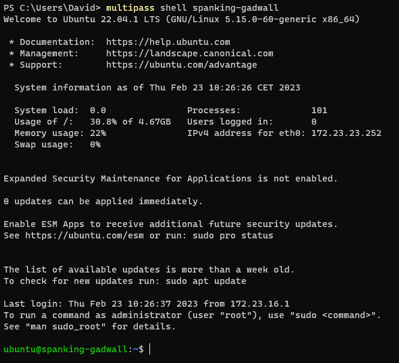

In order to permamently delete an instance we need to use two commands:

_The first command removes the instance from the list._

```
multipass delete <name of instance>
```

_The second command is to clear the recycling bin of multipass and remove all the files of the instance._

```
multipass purge
```

This is what my result looks like:

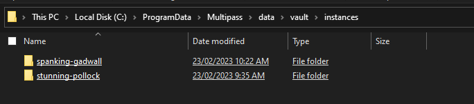

_The image above shows the file system before the purge._

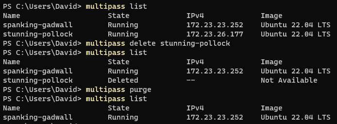

_The image above shows my deleting process (in combination with the `list` command)._

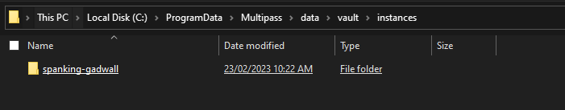

_Only after the purge the files of the instance are deleted in the file system (see image above)._

---
## D)
I will now install a web and database server on my `spanking-gadwall` instance

First of all I can use the `shell` command to access my instance shell (see step B).

Now I use the following commands to update my linux system, install an apache web server,\
php, a php extention for apache, a maria db and a php module for db requests.

```
sudo apt update
sudo apt upgrade
sudo apt install apache2
sudo apt install php
sudo apt install libapache2-mod-php
sudo apt install mariadb-server
sudo apt install php-mysqli
```

Next up I will create a new user with the credentials **admin** and **password**:

```
sudo mysql -sfu root -e "GRANT ALL ON *.* TO 'admin'@'%' IDENTIFIED BY 'password' WITH GRANT OPTION;"
```

Now I will clone the following repository to my home directory:

```
git clone https://gitlab.com/ch-tbz-it/Stud/m346/m346scripts.git
```

From this repository I will copy the html files to my web server:

```
sudo cp ./m346scripts/KN01/*.php /var/www/html/
```

My Instance IP4 Address is: **172.23.23.252** (use the `list` command to display)

To check if my servers are up and running I will use the browser of my host system and call following urls:

1. http://172.23.23.252/index.html
2. http://172.23.23.252/info.php
3. http://172.23.23.252/db.php

Here are my Results:

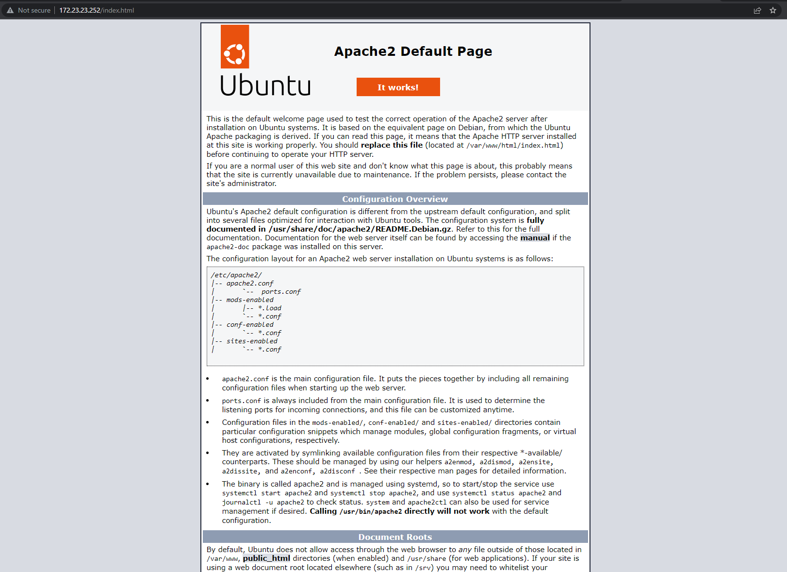

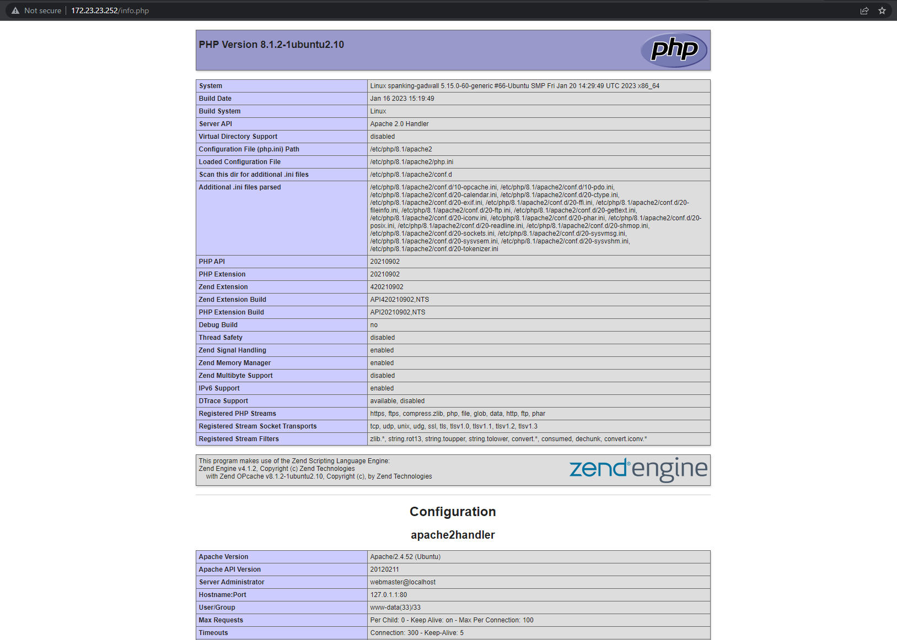

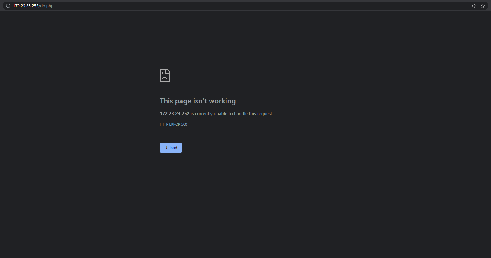

_Note: The last request returned a 500 error (something is probably wrong with the code)._

---
<div style="display: flex; justify-content: space-between;">
    <p>Author</p>
    <p>David Abderhalden</p>
</div>