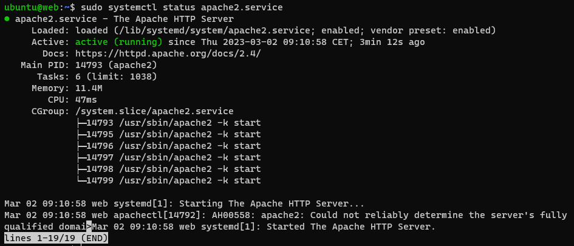
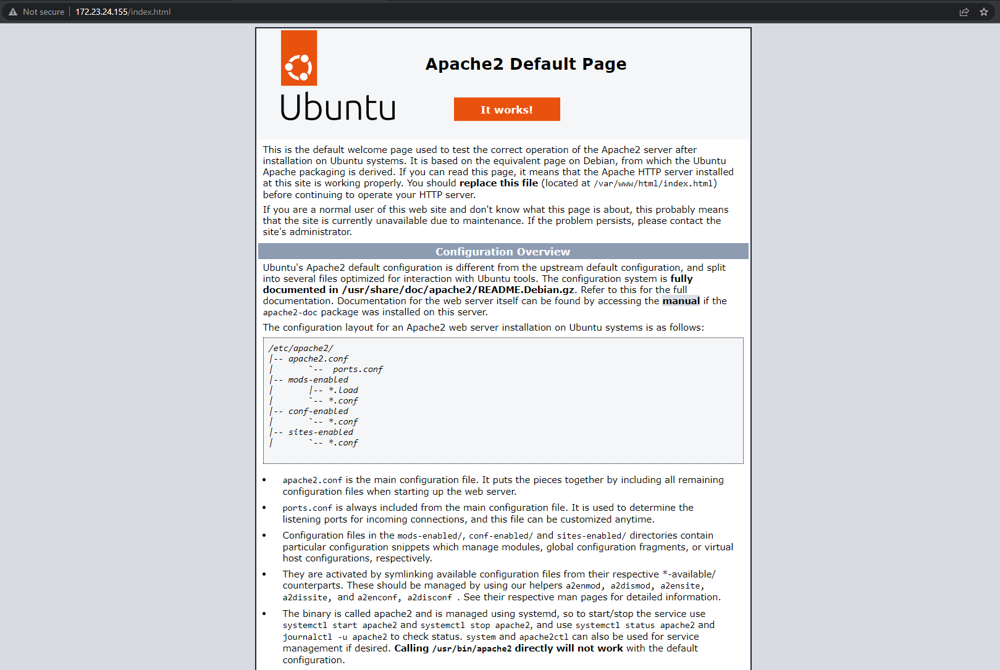
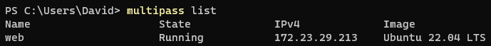
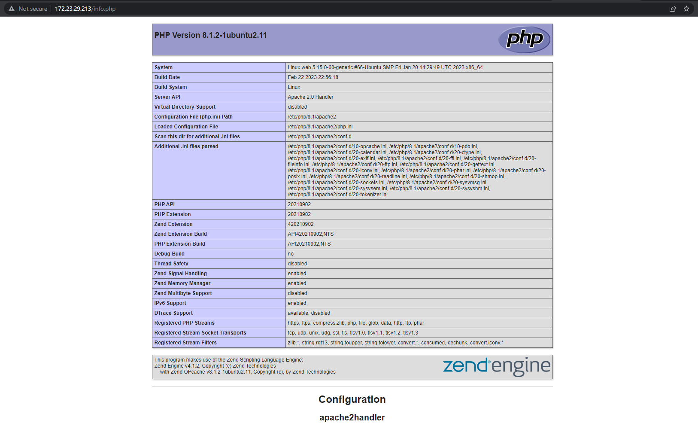
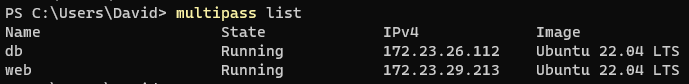
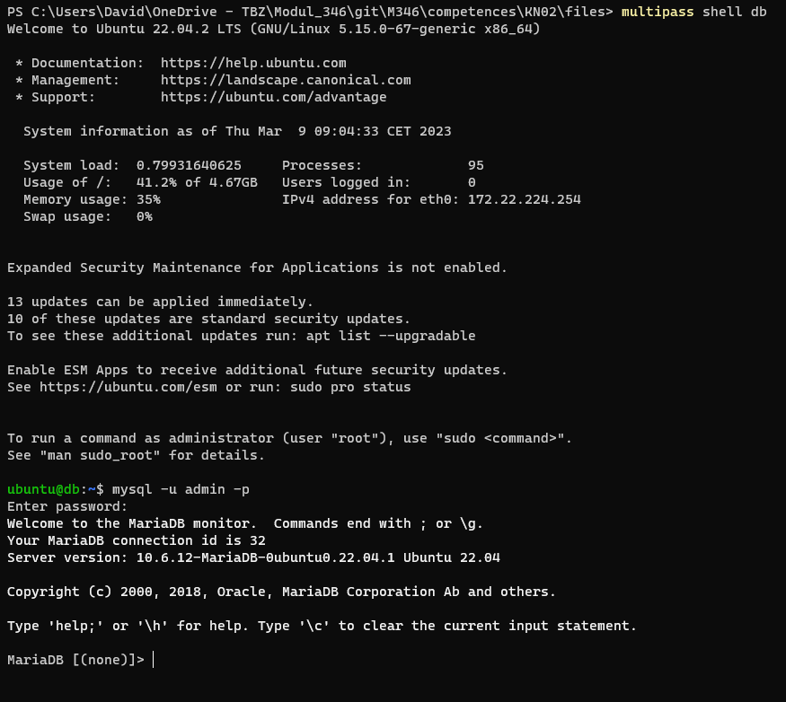
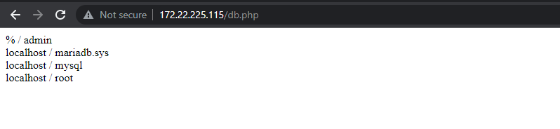
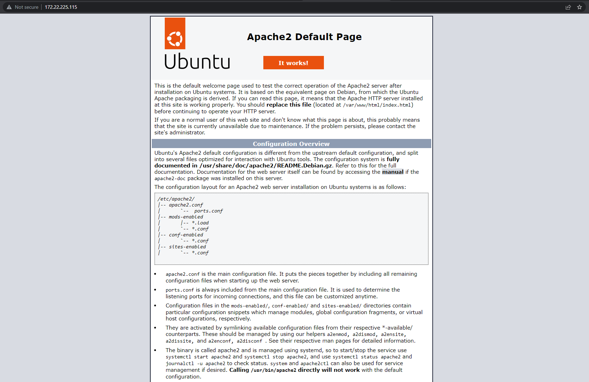
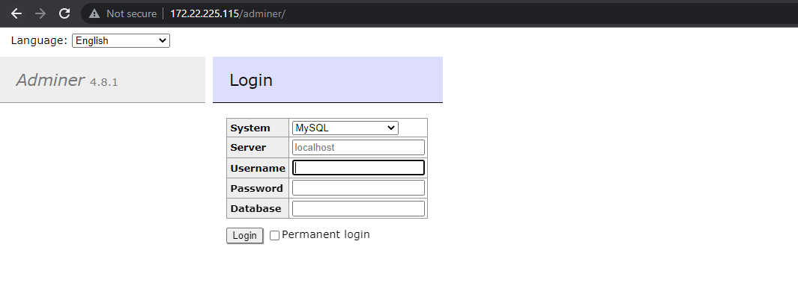
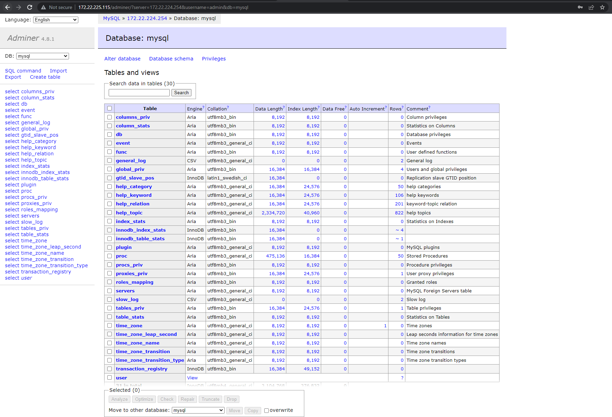

# KN02
[Task Description](/task/KN02.pdf)

Note: During the documentation ip addresses of my instances my change (due to restarts...) I will always describe what instance I talk about though.

## Steps
---

## A)

Description of the downloaded example cloud-init file:
```yaml
users: # Collection of users
  - name: ubuntu # The username of the first user
    sudo: ALL=(ALL) NOPASSWD:ALL # sudo rules for the first user
    groups: users, admin # The groups the first user is part of
    home: /home/ubuntu # The home directory of the first user
    shell: /bin/bash # The location of the shell on the machine
    lock_passwd: false # Disables password login when true
    plain_text_passwd: 'password' # The first user password in plain text   
ssh_pwauth: true # sshd will be configured to accept password authentication
disable_root: false # Root login is not disabled
packages: # All the packages that need to be installed on the machine
  - apache2 
  - curl 
  - wget 
  - php 
  - libapache2-mod-php 
  - php-mysqli
```

## B)

Next up I will launch an instance with the file above, using the following command:

```
multipass launch 22.04 --name web --cloud-init <pfad>\cloud-init-web.yaml
```

_for the \<path> I will specify the path to the cloud-init-web.yaml file on my computer._


To test the web server I will switch on a shell of the instance (see [KN01](../KN01/KN01_doc.md)) and use following command:

```
sudo systemctl status apache2.service
```

From the result I can tell that my setup worked and the web server is running:



Just to make sure everything works fine I will access the web server with my hosts browser `172.23.24.155\index.html` where `172.23.24.155` is the ip address of my web instance.



_I am promped with the default apache page which is a good sign._

## C)

In a next step I want to start the two servers from [KN01](../KN01/KN01_doc.md) but this time with a cloud-init file. 

### a)

First up I will start the apache server with the two php sites. I create a new yaml file called [cloud-init-web.yaml](./files/cloud-init-web.yaml) using the following configuration:

```yaml
users:
  - name: ubuntu
    sudo: ALL=(ALL) NOPASSWD:ALL
    groups: users, admin
    home: /home/ubuntu
    shell: /bin/bash
    lock_passwd: false
    plain_text_passwd: 'password'        
ssh_pwauth: true
disable_root: false 
packages:
  - apache2 
  - curl 
  - wget 
  - php 
  - libapache2-mod-php 
  - php-mysqli
  - adminer

write_files:
  - path: /var/www/html/info.php
    content: |
        <?php

        // Show all information, defaults to INFO_ALL
        phpinfo();

        ?>
    permissions: '0644'
  - path: /var/www/html/db.php
    content: |
        <?php
            //database
            $servername = "127.0.0.1";
            $username = "admin";
            $password = "password";
            $dbname = "mysql";

            // Create connection
            $conn = new mysqli($servername, $username, $password, $dbname);
            // Check connection
            if ($conn->connect_error) {
                    die("Connection failed: " . $conn->connect_error);
            }

            $sql = "select Host, User from mysql.user;";
            $result = $conn->query($sql);
            while($row = $result->fetch_assoc()){
                    echo($row["Host"] . " / " . $row["User"] . "<br />");
            }
            //var_dump($result);
        ?>
    permissions: '0644'
```

To add the packet `adminer` I will need to add it to packages and execute a command. I can do that in the cloud init file via `runcmd`, which only runs during the first boot.

```yaml
runcmd:
  - sudo a2enconf adminer
  - sudo systemctl restart apache2
```

_As you can see it is also mandatory to restart the apache service after._

Now I will launch my instance from the cloud init with the same command as in B).

To test if the pages are reachable and working I first need to determin the instances ip address:



Now I can access the `172.23.29.213/info.php`.



### b)

Next up I will create a separate cloud-init file for the database server. This file will be called [cloud-init-db.yaml](./files/cloud-init-db.yaml).

The configuration is as follows:

```yaml
users:
  - name: ubuntu
    sudo: ALL=(ALL) NOPASSWD:ALL
    groups: users, admin
    home: /home/ubuntu
    shell: /bin/bash
    lock_passwd: false
    plain_text_passwd: 'password'        
ssh_pwauth: true
disable_root: false 
packages:
  - mariadb-server
runcmd:
  - sudo mysql -sfu root -e "GRANT ALL ON *.* TO 'admin'@'%' IDENTIFIED BY 'password' WITH GRANT OPTION;"
```

In order to be able to connect to the database with an external machine we need to add the following command in the `runcmd`:

```yaml
sudo sed -i 's/127.0.0.1/0.0.0.0/g' /etc/mysql/mariadb.conf.d/50-server.cnf
sudo systemctl restart mariadb.service
```



To make sure that the database is working I will use the `shell` command and open a shell of my db instance. There I can call the database shell with following command:

```ps
mysql -u admin -p
```



I can also check my global connection with `telnet`. Therefore I need the ip of my db instance which is in my case `172.22.224.254`

```ps
telnet 172.22.224.254 3306
```


In order to be able to connect to the database with the web servers php script I need to change the servername to my db ip address and of course rebuild the web instance:

```php
-             $servername = "127.0.0.1";
+             $servername = "172.22.224.254";
```

After launching this instance too I can now try to reach the `172.22.225.115/db.php` endpoint on my web server. 



The index.php file and adminer we configured earlier in the cloud init file is also reachable under:

`172.22.225.115/index.php`



`172.22.225.115/adminer`



If I use my configured login (server-ip: 172.22.224.254, username: admin, password: password) and select a database eg. mysql I will be redirected to the database:



---
<div style="display: flex; justify-content: space-between;">
    <p>Author</p>
    <p>David Abderhalden</p>
</div>