# KN03
[Task Description](./task/KN03.pdf)

## Steps
---

## A)

The first task is to read all the 4 Modules. I also successfully finished the corresponding knowledge checks. 

### a)

In the following section I will provide some screenshots and descriptions of my AWS EC2 Instance I created following the instructions of the `Lab 4.1 - EC2`.

_The image below shows the created html page of the new web server. In the url you can see the DNS hostname of the AWS instance I just created. You can also see, that the web site is not secure. This is because we have not yet configured a TLS handshake in our server (the protocol is still only http)._


_I am also able to reach my service over the public ip address._

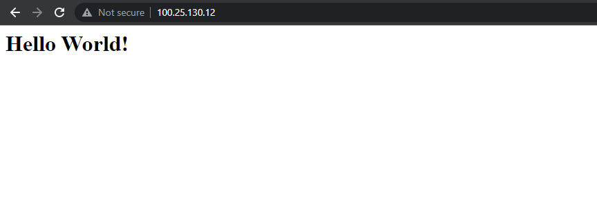

_The next image shows a list of all the instances in my AWS management console. As you can see my Web Server is running and all checks have passed. The Instances tab also shows some meta information. To see more details of my running instance I can select it and switch to the details tab._

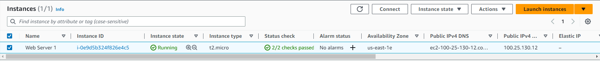

_This screenshot shows the details tab of my AWS instance (Web-Server-1). Here you can see informations like the public ip and DNS name but also private ip and DNS hostname used by internal requests inside the `VPC`._

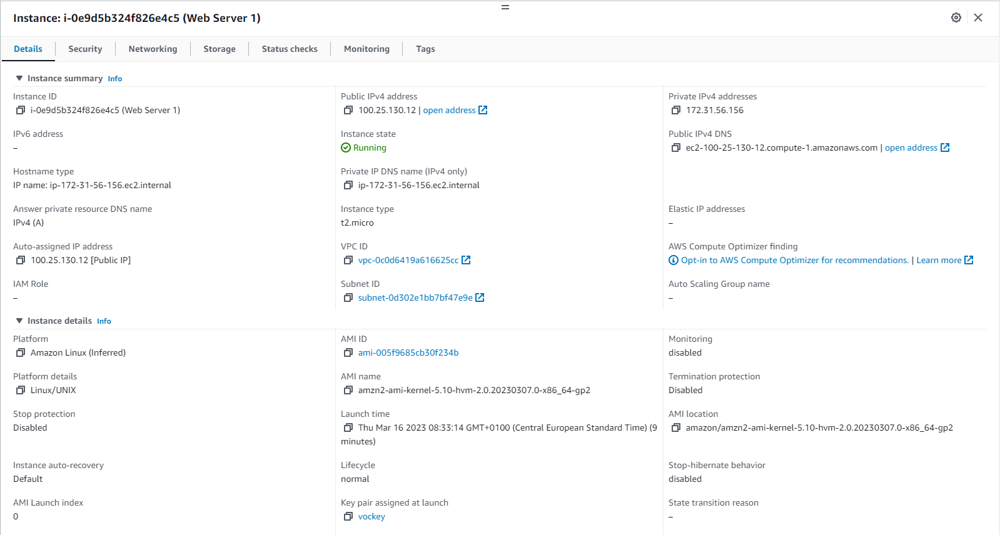

_The last image shows the inbound rules tab of my newly created security rule, which I assigned to my Web-Server-1 instance. You can see that I created a new inbound rule which is neccessarry to access the instance over the internet. The security groups act as a kind of firewall so I defined my rule to accept all request over the HTTP protocol from anywhere (0.0.0.0/0)_

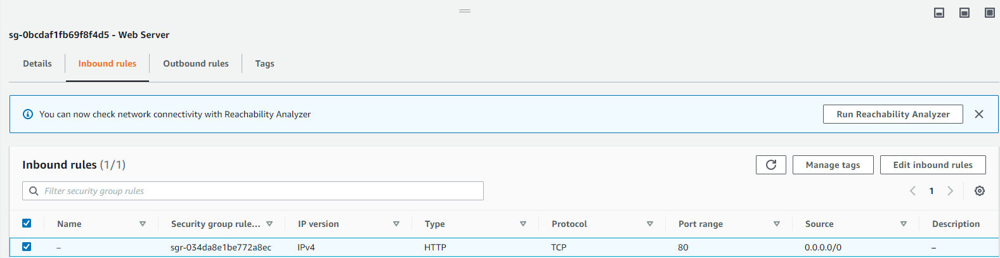

### b)

In the following section I will provide some screenshots and descriptions of my AWS S3 Instance I created following the instructions of the `Lab 4.2 - S3`.

_The first screenshot shows the AWS S3 management console. Under buckets all my created S3 buckets are displayed, in my case only the `m346-s3-lab-1` bucket I created for the exercise._

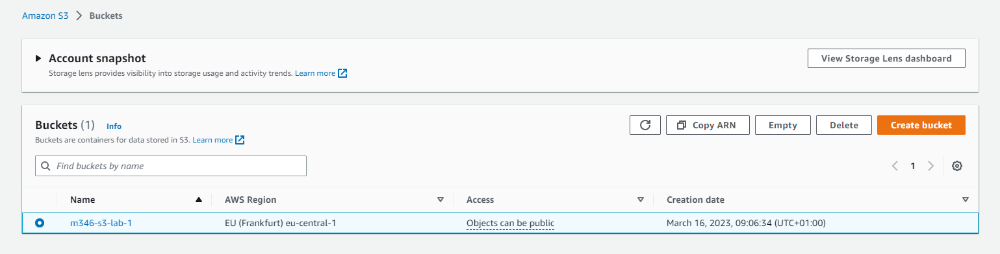

_Next up is the static website. This is only an index.html file stored in my S3 bucket. During the creation process of my bucket I made sure to make it publically accessable._

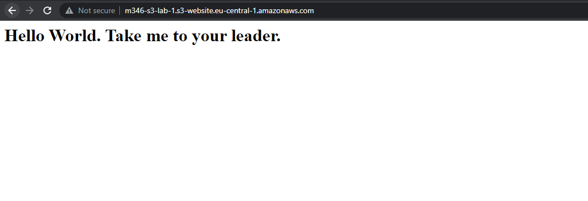

_The next screenshot provides a list of all the objects (files) I uploaded to my bucket. In my case this is only the index.html file which I use for the static website (image above). I am of course able to upload even more files, which won't have to be hosted as a static website._

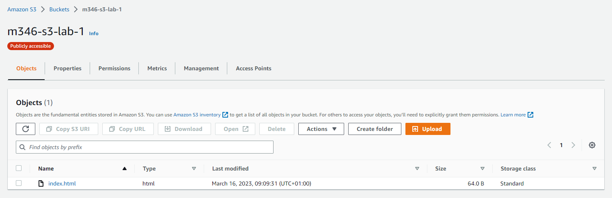

_To tell my bucket which files to use as static website I first had to enable the `Static web hosting` service. Next up I had to tell my bucket, which file to use as my website (in my case index.html). In the image below you can see the exact configuration of this `Static web hosting` service, for example its endpoint._

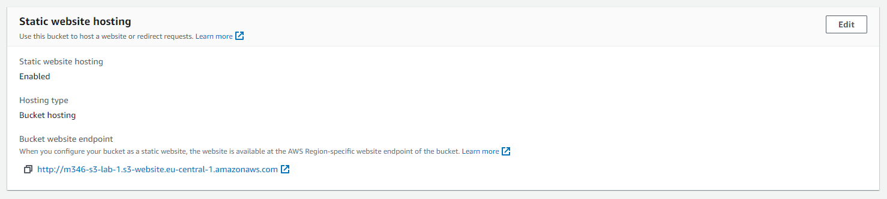

## B)

For this exercise I again start the `Lab 4.1 - EC2` and create a new Instance. This time I also create a new Key Value pair with the name `David-Abderhalden-1`. My PC automatically downloads the private key and I save it in my users `.ssh` folder.

It is also really important that the Security Rules for the SSH protocol allow connections from everywhere (0.0.0.0/0). This is already in the default settings so I won't touch them. 

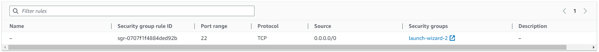

As soon as my instance is started and all the tests have passed I open a Terminal and try to connect to my AWS instance whith the following command:

```
ssh ubuntu@44.197.207.150 -i C:\Users\David\.ssh\David-Abderhalden-1.pem -o ServerAliveInterval=30
```

Note: for the ip address I have to use the public ip of my instance.

If everything works well I should be prompted with a shell of my AWS instance:

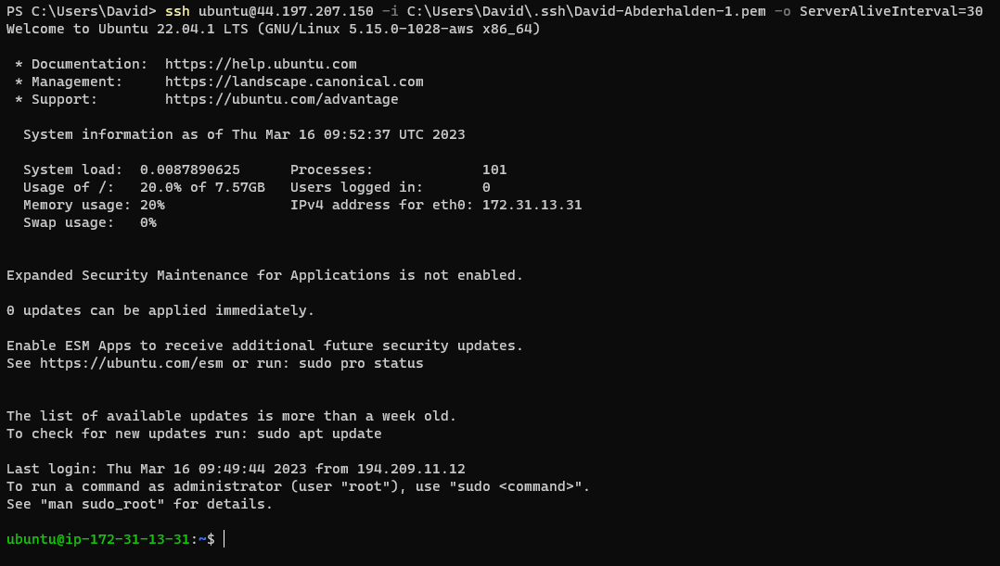

## C)

Next up I will create a new EC2 instance but configure my SSH Key inside of the cloud-init file instead of the GUI.

I still select my second ssh key over the GUI.

Under Advanced settings I am able to load a cloud-init configuration,
I input the following cloud-init with my public key of the first ssh key:

```yaml
#cloud-config
users:
  - name: ubuntu
    sudo: ALL=(ALL) NOPASSWD:ALL
    groups: users, admin
    home: /home/ubuntu
    shell: /bin/bash
    ssh_authorized_keys:
      - ssh-rsa AAAAB3NzaC1yc2EAAAADAQABAAABAQC6lpo3pXfnBCXISVAapHYlDd5uybJlQrcGstabUbHAWMoSRMGMTSrMx4YP4wnUR2Zrv68n8Nm7ZonyV77CMQP7jVVlMwhw0bA9TEsCvEOmo9KQPwn6WoH2DequDsCTZtHrFFfZrs+V9CuUP28GQPaZyMprB4cP7a906BHLfx6C1spHWF4CcVuNM7lJGFaN+roX6XKu9uhrwY0LovifpZu83rmANNh76pXgWEBnfNzV5FM8k98z2u9enbAHtRwuc/r0qoHurAoMhiL8RlfeqhgCFXq5H+8xKIu/M/tvxBXYGwZw+7a6rnPkKFdVBDM5kf44d9fDsaj94stftFfi8Ls9 aws-key
ssh_pwauth: false
disable_root: false    
```

After I started the new EC2 instance and check that all tests have passed I connect to the instance with the first ssh key (public key in cloud-init).

For that I use the following command:

```
ssh ubuntu@54.237.97.198 -i C:\Users\David\.ssh\David-Abderhalden-1.pem -o ServerAliveInterval=30
```

_The ip address is again the public ip of my EC2 instance._

As you can see I am also able to configure my key in the cloud-init file. The image below shows the successful connection:

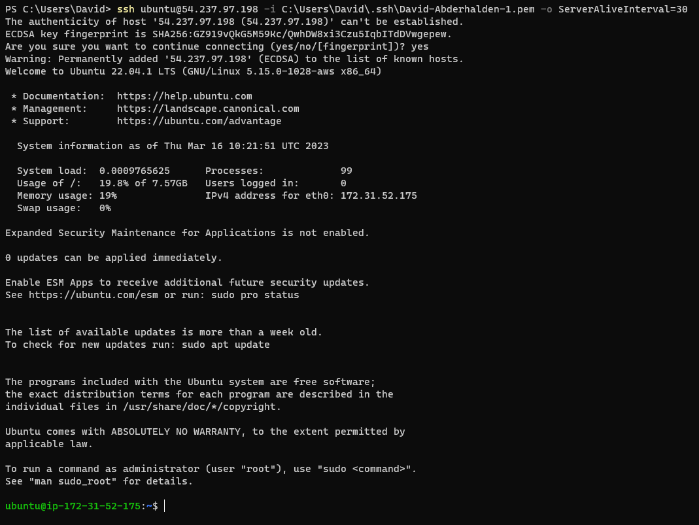

---
<div style="display: flex; justify-content: space-between;">
    <p>Author</p>
    <p>David Abderhalden</p>
</div>