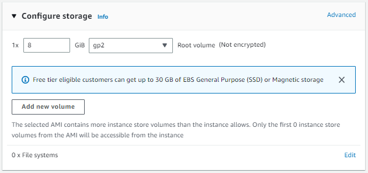
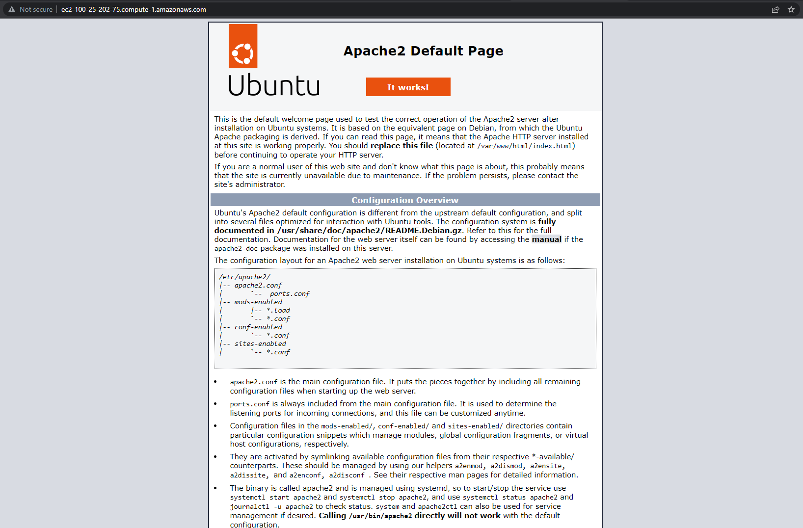

# KN03
[Task Description](./task/KN04.pdf)

## Steps
---

## A)

For this exercise I will setup two AWS EC2 instances and deploy my database and web server from [KN02](../KN02/KN02_doc.md). 

First I will start by setting up the database instance. Here is my existing cloud-init configuration:

```yaml
#cloud-config
users:
  - name: ubuntu
    sudo: ALL=(ALL) NOPASSWD:ALL
    groups: users, admin
    home: /home/ubuntu
    shell: /bin/bash  
    ssh_authorized_keys:
      - ssh-rsa AAAAB3NzaC1yc2EAAAADAQABAAABAQC0WGP1EZykEtv5YGC9nMiPFW3U3DmZNzKFO5nEu6uozEHh4jLZzPNHSrfFTuQ2GnRDSt+XbOtTLdcj26+iPNiFoFha42aCIzYjt6V8Z+SQ9pzF4jPPzxwXfDdkEWylgoNnZ+4MG1lNFqa8aO7F62tX0Yj5khjC0Bs7Mb2cHLx1XZaxJV6qSaulDuBbLYe8QUZXkMc7wmob3PM0kflfolR3LE7LResIHWa4j4FL6r5cQmFlDU2BDPpKMFMGUfRSFiUtaWBNXFOWHQBC2+uKmuMPYP4vJC9sBgqMvPN/X2KyemqdMvdKXnCfrzadHuSSJYEzD64Cve5Zl9yVvY4AqyBD aws-key  
      - ssh-rsa AAAAB3NzaC1yc2EAAAADAQABAAABAQC6lpo3pXfnBCXISVAapHYlDd5uybJlQrcGstabUbHAWMoSRMGMTSrMx4YP4wnUR2Zrv68n8Nm7ZonyV77CMQP7jVVlMwhw0bA9TEsCvEOmo9KQPwn6WoH2DequDsCTZtHrFFfZrs+V9CuUP28GQPaZyMprB4cP7a906BHLfx6C1spHWF4CcVuNM7lJGFaN+roX6XKu9uhrwY0LovifpZu83rmANNh76pXgWEBnfNzV5FM8k98z2u9enbAHtRwuc/r0qoHurAoMhiL8RlfeqhgCFXq5H+8xKIu/M/tvxBXYGwZw+7a6rnPkKFdVBDM5kf44d9fDsaj94stftFfi8Ls9 aws-key        
ssh_pwauth: false
disable_root: false 
packages:
  - mariadb-server
runcmd:
  - sudo mysql -sfu root -e "GRANT ALL ON *.* TO 'admin'@'%' IDENTIFIED BY 'password' WITH GRANT OPTION;"
  - sudo sed -i "s/127.0.0.1/0.0.0.0/g" /etc/mysql/mariadb.conf.d/50-server.cnf
  - sudo systemctl restart mariadb.service
```

As you can see I changed some of the the `ssh access` settings and added the public key of the teacher as demanded in [KN03](../KN03/KN03_doc.md) as well as my personal public key. 

As you can see in the image below, my database instance (btw called `KN04-database`) runs in a Ubuntu operating system as a `t2.micro` (1 virtual CPU, 1 GiB of memory). 


Right now I won't touch the Network Settings, I can always later add a new Security Group the and open up the database port. 

I also leave the Storage Setting as default: 


In the input field "User Data" under Advanced Settings I add my cloud-init configuration from above:


Now I am ready to launch the instance. 

While my database instance is launching I will configure my web instance. For the configuartion I am also able to use the cloud-init file from KN02 with some tweaks to the authentication (no password login only ssh plus adding the public key of the teacher and mine). 

```yaml
#cloud-config
users:
  - name: ubuntu
    sudo: ALL=(ALL) NOPASSWD:ALL
    groups: users, admin
    home: /home/ubuntu
    shell: /bin/bash
    ssh_authorized_keys:
      - ssh-rsa AAAAB3NzaC1yc2EAAAADAQABAAABAQC0WGP1EZykEtv5YGC9nMiPFW3U3DmZNzKFO5nEu6uozEHh4jLZzPNHSrfFTuQ2GnRDSt+XbOtTLdcj26+iPNiFoFha42aCIzYjt6V8Z+SQ9pzF4jPPzxwXfDdkEWylgoNnZ+4MG1lNFqa8aO7F62tX0Yj5khjC0Bs7Mb2cHLx1XZaxJV6qSaulDuBbLYe8QUZXkMc7wmob3PM0kflfolR3LE7LResIHWa4j4FL6r5cQmFlDU2BDPpKMFMGUfRSFiUtaWBNXFOWHQBC2+uKmuMPYP4vJC9sBgqMvPN/X2KyemqdMvdKXnCfrzadHuSSJYEzD64Cve5Zl9yVvY4AqyBD aws-key  
      - ssh-rsa AAAAB3NzaC1yc2EAAAADAQABAAABAQC6lpo3pXfnBCXISVAapHYlDd5uybJlQrcGstabUbHAWMoSRMGMTSrMx4YP4wnUR2Zrv68n8Nm7ZonyV77CMQP7jVVlMwhw0bA9TEsCvEOmo9KQPwn6WoH2DequDsCTZtHrFFfZrs+V9CuUP28GQPaZyMprB4cP7a906BHLfx6C1spHWF4CcVuNM7lJGFaN+roX6XKu9uhrwY0LovifpZu83rmANNh76pXgWEBnfNzV5FM8k98z2u9enbAHtRwuc/r0qoHurAoMhiL8RlfeqhgCFXq5H+8xKIu/M/tvxBXYGwZw+7a6rnPkKFdVBDM5kf44d9fDsaj94stftFfi8Ls9 aws-key        
ssh_pwauth: false
disable_root: false 
packages:
  - apache2 
  - curl 
  - wget 
  - php 
  - libapache2-mod-php 
  - php-mysqli
  - adminer

write_files:
  - path: /var/www/html/info.php
    content: |
      <?php

      // Show all information, defaults to INFO_ALL
      phpinfo();

      ?>
    permissions: '0644'
  - path: /var/www/html/db.php
    content: |
      <?php
          //database
          $servername = "172.31.14.84";
          $username = "admin";
          $password = "password";
          $dbname = "mysql";

          // Create connection
          $conn = new mysqli($servername, $username, $password, $dbname);
          // Check connection
          if ($conn->connect_error) {
                  die("Connection failed: " . $conn->connect_error);
          }

          $sql = "select Host, User from mysql.user;";
          $result = $conn->query($sql);
          while($row = $result->fetch_assoc()){
                  echo($row["Host"] . " / " . $row["User"] . "<br />");
          }
          //var_dump($result);
      ?>
    permissions: '0644'

runcmd:
  - sudo a2enconf adminer
  - sudo systemctl restart apache2
```

Another mandatory change is the variable `$servername` in the `db.php` file. It is really important that I change the ip address. Because I will start both instances in the same region and thus the same `VPC` I should be able to use the private ip address of my database instance.

The image below shows the details tab of my running database instance:

(Private-IP: `172.31.14.84`).


For the webserver operating system I also choose Ubuntu. I will also select the free tier `t2.micro` Instance type because for my purposes it has enough capacity. 


The Network Settings as well as the Storage configuration don't need to be changes and I leave the as is:



Now the last step remaining before I can launche my web server instance is to add my cloud-init configuration from above into the "User Data" input field under Advanced Settings:


The screenshot below shows the details tab of my web server instance:


The screenshot below shows both of my instances (`KN04-database`, `KN04-webserver`) up and running in the AWS instance overview page:


Next up I need to tweak some of the Security Group settings of the database instance in order for the web server to be able to connect to the database port as well as some rules on the web server, in order to be able to access the HTTP port form my machine. 

The screenshot below shows the security group inbound rules of my web server:


As you can see I am now able to connect to the webserver and its routes like the `/info.php`:


Or the index page:



But the database connection still won't work because the port 3306 which is used by mariadb is still not open to the internet. The `/db.php` route gives me an internal server error which was expected. 


Let's change that. I will just open the database port to anywhere in the internet for now. Correctly it should only be reachable from inside of the `VPC`:


Now let's try that again:


That looks perfect. The web server instance is now able to reach our database instance on port 3306.

Now the last thing I can do to check the database connection status is to use the installed `adminer` service on our web server. For that I will navigate to the `/adminer` route of the web server and login with the database user we created in the config-init file (username: 'admin', password: 'password'). For the ip address I select the public ip of my database instance which is: `44.203.102.170`.


As you can see in the screenshot below, the adminer login worked and I am able to see all the tables etc. of the `mysql` database (which I selected).


## B)

### a) 

I would assign the S3 Storage Bucket from AWS to the "Cool Storage" or "Warm Storage" storage model.

### Reason
---
S3 is certainly not a database, and I wouldn't call it cold storage either, since these are mostly used for backups, which is not the primary purpose of S3. Because S3 still exists after an instance is deleted, it doesn't count as hot storage. So, as I just said, only warm storage comes into question.

### b)

I create a simple EC2 Ubuntu instance on AWS with no special configurations called `KN04-B-Instance`.

Next I switch to the Volumes tab and click "Create Volume". I leave all the settings as is and only make sure the "Availability Zone" is set to `us-east-1c` because that's the zone my EC2 instance is running on.


As soon as the volume is created I need to attach it to my instance. I select the new volume and choose the "attach" option. Then in the GUI I select my instance and leave the mount path as is. I chould change the name of `sdf` to something else in the range `sd[f-p]` but this is not mandatory. The important part here is that I don't mount my new volume as root volume (`/dev/sda1`).

