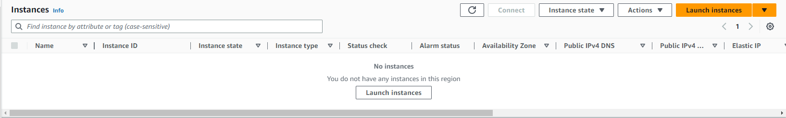
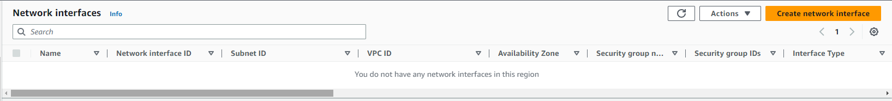
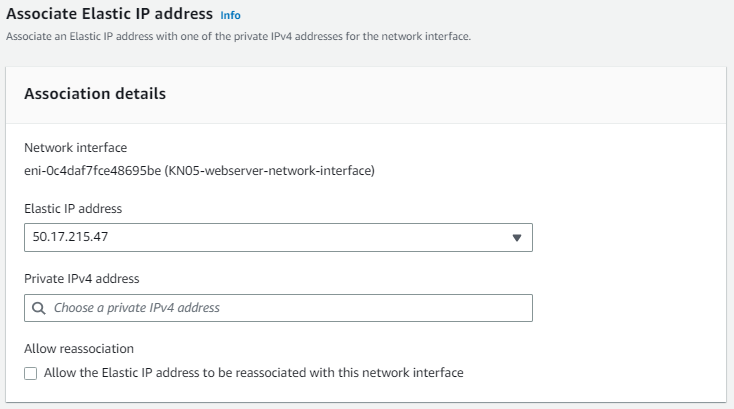
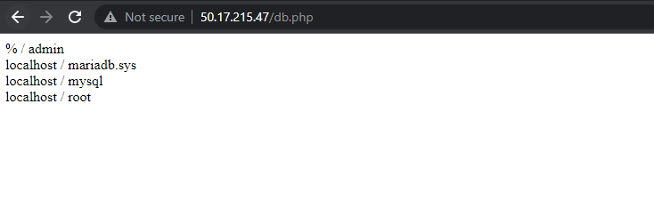

# KN05
[Task Description](./task/KN05.pdf)

## Steps
---

## A)

First of all I need to delete all of the existing instances, network interfaces, security groups (except default) and subnetworks.

_As you can see no instance is left._



_I also deleted all of the network interfaces._



_In the security groups tab I left only the default group._


_And finally the subnets. I navigated to `Services -> Networking & Contend Delivery -> VPC -> Subnets` and removed all of the existing subnets._


## B)

### 1.

Now I will set up my own Network settings etc. First of all I will start with the `VPC Subnet`. The subnet should range from `172.31.10.0` to `172.31.10.255` (`172.31.10.0/24`) where `172.31.0.0/16` is the IPv4 CIDRs of my VPC.

_The image below shows the gui configuration of my new subnet (KN05-subnet)._


_The newly created subnet is displayed in the Subnets Overview._


A very important step and first a bit tricky for me to find was to enable the `Enable auto-assign public IPv4 address`. To do that I have to right click on my subnet and select "Edit". After that enable the checkbox to auto assign a public IPv4.

_In the screenshot below you can see my "Edit Subnet" settings with the enabled checkbox._


### 2.

I continue to create two security groups, one for my database and one for the web server. 

For the database security group I need to only allow inbound traffic to the database port from my subnet I just created.

_The configuration of my database security group (KN05-database-security-group)._


The security group of my web server is a bit more straight forward. I just need to add an inbound rule to allow traffic over HTTP from anywhere (so that everybody can access my the application).

_The screenshot below shows the web servers security group (KN05-webserver-security-group) settings._


_And lastly here is the overview of both of my new security groups._


### 3.

My next step is to create an `Elastic IP`. The elastic ip is basically a reserved IP address I can later assign to my EC2 instances. It is pretty straight forward, I just click `Allocate Elastic IP address` and don't have to touch any of the configurations. The Public IP created is `50.17.215.47`.

_The list of my Elastic IPs created by AWS._


### 4.

Befor I am able to finally launch my EC2 instances I still need to create two "Network Interfaces", one for each instance. I also need to allocate a private IP address (range inside my subnet) to each of my instances. Here are my ips:
- Database private IPv4: `172.31.10.10`
- Webserver private IPv4: `172.31.10.20`

Now let's create the two "Network Interfaces". 

I start with the creation of the database network interface (KN05-database-network-interface). Some important settings are the subnet, where I choose my earlier created one, the private IPv4, where I select custom and add the one I specified for my database instance and also the security group. For my database network instance I of course choose the security group `KN05-database-security-group`. I am also able to give the network interface a name over the tags. 


For the web servers network interface I do pretty much the same, except for using the private IPv4 of my web server instance and its security group (`KN05-webserver-security-group`).


_In the screenshot below you can see the list of my two network interfaces._


But as of now the web server network interface is not publicly reachable. So we need to assign the elastic ip we just created to the `KN05-webserver-network-interface` as you can see in the image below. 



_Details section of `KN05-webserver-network-interface`._


_Details section of `KN05-database-network-interface`._


### 5. 6. 7.

Finally I can start to setup my EC2 instances. First I will prepare the cloud-init configuration for both instances. 

_Below you can see my cloud-init file for the database. I added my ssh key as well as the teachers and changed some commands._

```yaml
#cloud-config
users:
  - name: ubuntu
    sudo: ALL=(ALL) NOPASSWD:ALL
    groups: users, admin
    home: /home/ubuntu
    shell: /bin/bash  
    ssh_authorized_keys:
      - ssh-rsa AAAAB3NzaC1yc2EAAAADAQABAAABAQC0WGP1EZykEtv5YGC9nMiPFW3U3DmZNzKFO5nEu6uozEHh4jLZzPNHSrfFTuQ2GnRDSt+XbOtTLdcj26+iPNiFoFha42aCIzYjt6V8Z+SQ9pzF4jPPzxwXfDdkEWylgoNnZ+4MG1lNFqa8aO7F62tX0Yj5khjC0Bs7Mb2cHLx1XZaxJV6qSaulDuBbLYe8QUZXkMc7wmob3PM0kflfolR3LE7LResIHWa4j4FL6r5cQmFlDU2BDPpKMFMGUfRSFiUtaWBNXFOWHQBC2+uKmuMPYP4vJC9sBgqMvPN/X2KyemqdMvdKXnCfrzadHuSSJYEzD64Cve5Zl9yVvY4AqyBD aws-key  
      - ssh-rsa AAAAB3NzaC1yc2EAAAADAQABAAABAQC6lpo3pXfnBCXISVAapHYlDd5uybJlQrcGstabUbHAWMoSRMGMTSrMx4YP4wnUR2Zrv68n8Nm7ZonyV77CMQP7jVVlMwhw0bA9TEsCvEOmo9KQPwn6WoH2DequDsCTZtHrFFfZrs+V9CuUP28GQPaZyMprB4cP7a906BHLfx6C1spHWF4CcVuNM7lJGFaN+roX6XKu9uhrwY0LovifpZu83rmANNh76pXgWEBnfNzV5FM8k98z2u9enbAHtRwuc/r0qoHurAoMhiL8RlfeqhgCFXq5H+8xKIu/M/tvxBXYGwZw+7a6rnPkKFdVBDM5kf44d9fDsaj94stftFfi8Ls9 aws-key        
ssh_pwauth: false
disable_root: false 
packages:
  - mariadb-server
runcmd:
  - sudo mysql -sfu root -e "GRANT ALL ON *.* TO 'admin'@'%' IDENTIFIED BY 'password' WITH GRANT OPTION;"
  - sudo sed -i 's/127.0.0.1/0.0.0.0/g' /etc/mysql/mariadb.conf.d/50-server.cnf
  - sudo systemctl restart mariadb.service
```

_Below is the cloud-init configuration of my web server. Important: I changed the database ip address to the **private** IPv4 of the database instance (`172.31.10.10`). Of course I also added the two ssh keys._

```yaml
#cloud-config
users:
  - name: ubuntu
    sudo: ALL=(ALL) NOPASSWD:ALL
    groups: users, admin
    home: /home/ubuntu
    shell: /bin/bash
    ssh_authorized_keys:
      - ssh-rsa AAAAB3NzaC1yc2EAAAADAQABAAABAQC0WGP1EZykEtv5YGC9nMiPFW3U3DmZNzKFO5nEu6uozEHh4jLZzPNHSrfFTuQ2GnRDSt+XbOtTLdcj26+iPNiFoFha42aCIzYjt6V8Z+SQ9pzF4jPPzxwXfDdkEWylgoNnZ+4MG1lNFqa8aO7F62tX0Yj5khjC0Bs7Mb2cHLx1XZaxJV6qSaulDuBbLYe8QUZXkMc7wmob3PM0kflfolR3LE7LResIHWa4j4FL6r5cQmFlDU2BDPpKMFMGUfRSFiUtaWBNXFOWHQBC2+uKmuMPYP4vJC9sBgqMvPN/X2KyemqdMvdKXnCfrzadHuSSJYEzD64Cve5Zl9yVvY4AqyBD aws-key  
      - ssh-rsa AAAAB3NzaC1yc2EAAAADAQABAAABAQC6lpo3pXfnBCXISVAapHYlDd5uybJlQrcGstabUbHAWMoSRMGMTSrMx4YP4wnUR2Zrv68n8Nm7ZonyV77CMQP7jVVlMwhw0bA9TEsCvEOmo9KQPwn6WoH2DequDsCTZtHrFFfZrs+V9CuUP28GQPaZyMprB4cP7a906BHLfx6C1spHWF4CcVuNM7lJGFaN+roX6XKu9uhrwY0LovifpZu83rmANNh76pXgWEBnfNzV5FM8k98z2u9enbAHtRwuc/r0qoHurAoMhiL8RlfeqhgCFXq5H+8xKIu/M/tvxBXYGwZw+7a6rnPkKFdVBDM5kf44d9fDsaj94stftFfi8Ls9 aws-key        
ssh_pwauth: false
disable_root: false 
packages:
  - apache2 
  - curl 
  - wget 
  - php 
  - libapache2-mod-php 
  - php-mysqli
  - adminer

write_files:
  - path: /var/www/html/info.php
    content: |
      <?php

      // Show all information, defaults to INFO_ALL
      phpinfo();

      ?>
    permissions: '0644'
  - path: /var/www/html/db.php
    content: |
      <?php
          //database
          $servername = "172.31.10.10";
          $username = "admin";
          $password = "password";
          $dbname = "mysql";

          // Create connection
          $conn = new mysqli($servername, $username, $password, $dbname);
          // Check connection
          if ($conn->connect_error) {
                  die("Connection failed: " . $conn->connect_error);
          }

          $sql = "select Host, User from mysql.user;";
          $result = $conn->query($sql);
          while($row = $result->fetch_assoc()){
                  echo($row["Host"] . " / " . $row["User"] . "<br />");
          }
          //var_dump($result);
      ?>
    permissions: '0644'

runcmd:
  - sudo a2enconf adminer
  - sudo systemctl restart apache2
```

Now lets start by launching the database instance. I call it `KN05-databse` and select no SSH Key over the GUI (because we already have the keys in the cloud-init). For the OS I use ubuntu. Most of the settings I can leafe untouched, except adding my cloud-init configuration of the database and the "Network Settings".

_The screenshot below shows the "Network Settings" of my database instance. Under "Advanced" I choose to use an existing network interface._


For the web server instance `KN05-webserver` I choose pretty much the same settings as in the database instance except to use the web servers cloud-init and network interface. 

_Below you can see the network settings of my web server EC2 instance._


_Instance Overview with list of my running instances._


Now lets test the web server urls. I have to use the elastic IP as web server host. 
- index.html    -> `http://50.17.215.47`
- info.php      -> `http://50.17.215.47/info.php`
- db.php        -> `http://50.17.215.47/db.php`

_The index.html successfully loaded._


_The info.php successfully loaded._


_The db.php successfully loaded (could establish connection with database)._



---
<div style="display: flex; justify-content: space-between;">
    <p>Author</p>
    <p>David Abderhalden</p>
</div>