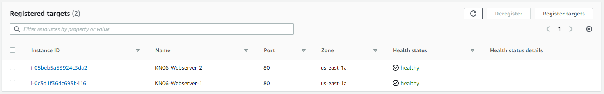
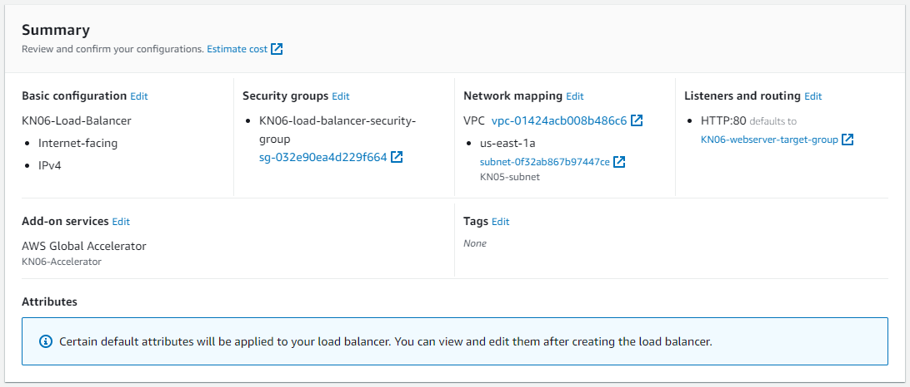
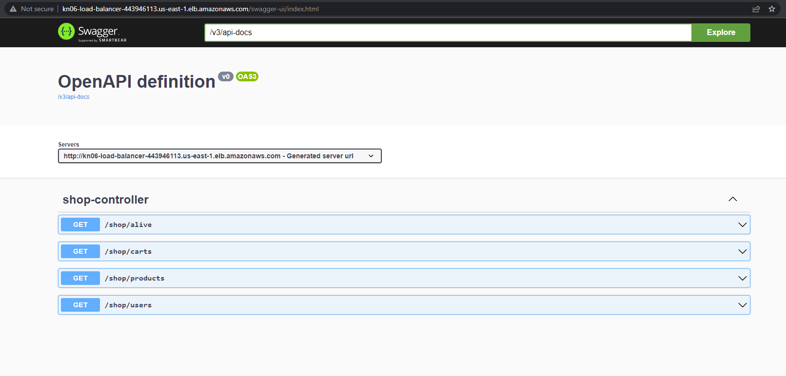
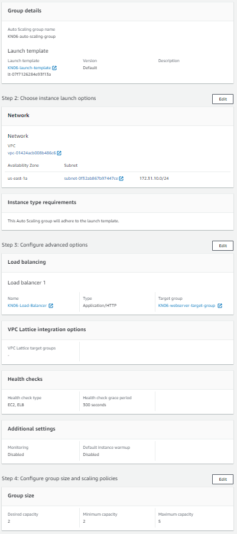

# KN06
[Task Description](./task/KN06.pdf)

## Steps
---

## A)

### 1.

To start with this exercise I will be able to reuse the network interfaces of [KN05](../KN05/KN05_doc.md).

I will also use the same ip addresses for my database and web server I used for [KN05](../KN05/KN05_doc.md):
- Database private IPv4: `172.31.10.10`
- Webserver private IPv4: `172.31.10.20`

First of all I will setup a new EC2 database Instance with the following cloud-init configuration:

```yaml
#cloud-config
users:
  - name: ubuntu
    sudo: ALL=(ALL) NOPASSWD:ALL
    groups: users, admin
    home: /home/ubuntu
    shell: /bin/bash
    ssh_authorized_keys:
      - ssh-rsa AAAAB3NzaC1yc2EAAAADAQABAAABAQC0WGP1EZykEtv5YGC9nMiPFW3U3DmZNzKFO5nEu6uozEHh4jLZzPNHSrfFTuQ2GnRDSt+XbOtTLdcj26+iPNiFoFha42aCIzYjt6V8Z+SQ9pzF4jPPzxwXfDdkEWylgoNnZ+4MG1lNFqa8aO7F62tX0Yj5khjC0Bs7Mb2cHLx1XZaxJV6qSaulDuBbLYe8QUZXkMc7wmob3PM0kflfolR3LE7LResIHWa4j4FL6r5cQmFlDU2BDPpKMFMGUfRSFiUtaWBNXFOWHQBC2+uKmuMPYP4vJC9sBgqMvPN/X2KyemqdMvdKXnCfrzadHuSSJYEzD64Cve5Zl9yVvY4AqyBD aws-key  
      - ssh-rsa AAAAB3NzaC1yc2EAAAADAQABAAABAQC6lpo3pXfnBCXISVAapHYlDd5uybJlQrcGstabUbHAWMoSRMGMTSrMx4YP4wnUR2Zrv68n8Nm7ZonyV77CMQP7jVVlMwhw0bA9TEsCvEOmo9KQPwn6WoH2DequDsCTZtHrFFfZrs+V9CuUP28GQPaZyMprB4cP7a906BHLfx6C1spHWF4CcVuNM7lJGFaN+roX6XKu9uhrwY0LovifpZu83rmANNh76pXgWEBnfNzV5FM8k98z2u9enbAHtRwuc/r0qoHurAoMhiL8RlfeqhgCFXq5H+8xKIu/M/tvxBXYGwZw+7a6rnPkKFdVBDM5kf44d9fDsaj94stftFfi8Ls9 aws-key  
ssh_pwauth: true
disable_root: false  
packages:
  - mariadb-server
runcmd:
  - sudo mysql -sfu root -e "GRANT ALL ON *.* TO 'admin'@'%' IDENTIFIED BY 'password' WITH GRANT OPTION;"
  - sudo sed -i 's/127.0.0.1/0.0.0.0/g' /etc/mysql/mariadb.conf.d/50-server.cnf
  - sudo systemctl restart mariadb.service
  - sudo cd /home/ubuntu
  - sudo git clone https://gitlab.com/ch-tbz-it/Stud/m346/m346scripts.git
  - sudo mysql -sfu root < ./m346scripts/KN06/shop-database.sql
```

For the operating system of the instance I choose `Ubuntu` and for the instance type `t1.micro`. The network interface I choose is called `KN05-database-network-interface`.
The storage size I can leave untouched at `1x 8GB`.

### 2.

Next up lets install the web server. Here I have two options, either use a .NET or Java Application. Because I have more experience with Java I will use the Java Application. 

Following is the cloud-init configuration of the web server instance:

```yaml
#cloud-config
users:
  - name: ubuntu
    sudo: ALL=(ALL) NOPASSWD:ALL
    groups: users, admin
    home: /home/ubuntu
    shell: /bin/bash
    ssh_authorized_keys:
      - ssh-rsa AAAAB3NzaC1yc2EAAAADAQABAAABAQC0WGP1EZykEtv5YGC9nMiPFW3U3DmZNzKFO5nEu6uozEHh4jLZzPNHSrfFTuQ2GnRDSt+XbOtTLdcj26+iPNiFoFha42aCIzYjt6V8Z+SQ9pzF4jPPzxwXfDdkEWylgoNnZ+4MG1lNFqa8aO7F62tX0Yj5khjC0Bs7Mb2cHLx1XZaxJV6qSaulDuBbLYe8QUZXkMc7wmob3PM0kflfolR3LE7LResIHWa4j4FL6r5cQmFlDU2BDPpKMFMGUfRSFiUtaWBNXFOWHQBC2+uKmuMPYP4vJC9sBgqMvPN/X2KyemqdMvdKXnCfrzadHuSSJYEzD64Cve5Zl9yVvY4AqyBD aws-key  
      - ssh-rsa AAAAB3NzaC1yc2EAAAADAQABAAABAQC6lpo3pXfnBCXISVAapHYlDd5uybJlQrcGstabUbHAWMoSRMGMTSrMx4YP4wnUR2Zrv68n8Nm7ZonyV77CMQP7jVVlMwhw0bA9TEsCvEOmo9KQPwn6WoH2DequDsCTZtHrFFfZrs+V9CuUP28GQPaZyMprB4cP7a906BHLfx6C1spHWF4CcVuNM7lJGFaN+roX6XKu9uhrwY0LovifpZu83rmANNh76pXgWEBnfNzV5FM8k98z2u9enbAHtRwuc/r0qoHurAoMhiL8RlfeqhgCFXq5H+8xKIu/M/tvxBXYGwZw+7a6rnPkKFdVBDM5kf44d9fDsaj94stftFfi8Ls9 aws-key  
ssh_pwauth: true
disable_root: false  
package_update: true
packages:
  - curl
  - wget
  - nginx
  - openjdk-18-jre
write_files:
  - content: |
      [Unit]
      Description=Demo Shop
      After=syslog.target
      [Service]
      WorkingDirectory=/var/www/app
      User=www-data
      ExecStart=java -jar /var/www/app/shopdemo-1.0.0.jar --spring.config.additional-location=production.properties SuccessExitStatus=143 
      Restart=always
      RestartSec=10
      [Install] 
      WantedBy=multi-user.target
    path: /etc/systemd/system/shop-app.service
  - content: |
      server {
        listen        80;
        server_name   50.17.215.47;
        location / {
          proxy_pass         http://127.0.0.1:5001;
          proxy_http_version 1.1;
          proxy_set_header   Upgrade $http_upgrade;
          proxy_set_header   Connection keep-alive;
          proxy_set_header   Host $host;
          proxy_cache_bypass $http_upgrade;
          proxy_set_header   X-Forwarded-For $proxy_add_x_forwarded_for;
          proxy_set_header   X-Forwarded-Proto $scheme;
        }
      }
    path: /home/ubuntu/nginx
runcmd:
  - sudo mkdir /var/www
  - sudo mkdir /var/www/app
  - sudo git clone https://gitlab.com/ch-tbz-it/Stud/m346/m346scripts.git
  - sudo sed -i 's/<your-connection-string>/jdbc:mysql:\/\/172.31.10.10:3306\/shop/g' ./m346scripts/KN06/java/production.properties
  - sudo cp -r ./m346scripts/KN06/java/* /var/www/app/
  - sudo systemctl enable shop-app.service
  - sudo systemctl start shop-app.service
  - sudo service nginx start
  - sudo cp /home/ubuntu/nginx /etc/nginx/sites-available/default
  - sudo nginx -s reload
```

I have to addapt some placeholders in the could-init template like the private ip address of the database instance (`172.31.10.10`) and the public ip address of the web server instance (Elastic IP: `50.17.215.47`).

To launch the instance I also addapt some settings, OS: `Ubuntu`, interface type `t1.micro` with `1x 8GB` storage and select the network interface of my web server (`KN05-webserver-network-interface`).

To check if my web application is working I call the following Swagger url and check out the response: `http://50.17.215.47/swagger-ui/index.html`.


As we can see in the screenshot above, Swagger works and I am able to check out the applications endpoints. 

Next up I make sure the database connection is working as well. Therefor I test one of the endpoints (in my case `/shop/alive`). Via the Swagger UI I can try the request.


The server responds with "I'm alive" which is a good sign. 

## B)

For the next exercise I will scale my web server and database instances vertically by increasing the disk size of the database instance to `20GB` and the instance type of the web server instance to `t2.medium`. The whole scaling will be made during ongoing operations.

Below are screenshots of the resource settings of both of my instances **before** the scaling:

`KN06-Database`


`KN06-Webserver`


To change the instance type I first have to stop the web server instance and then select `Actions -> Instance settings -> Change instance type`.

To increase the disk size I have to stop the database instance, navigate to the `Volumes` tab and on my database instance volume select `Actions -> Modify volume`.

Now I can start both of my instances again. Below are screenshots of the resource settings of both of my instances **after** the scaling:

`KN06-Database`


`KN06-Webserver`


## C)

In the following exercise I will create a Load Balancer for horizontal scaling of my instances. 

Following are the steps I had to take to create the Load Balancer

1. First off I create a new Network Interface for a second web server instance. As of now we have no Auto Scaling so I create it manutally and assign the private ip `172.31.10.21`. For the security group I reuse the one `KN05-webserver-security-group`.
Important: The idea is that both instances run in the same subnet so it is important that I use the same subnet for the Network Interface. I don't let a public ip be auto-assigned because if we access the instances over the Load Balancer, the instance itself doesn't need a public ip address.

2. Next up I can already start the second web server instance. I configure it just like the first one (except a bit less ressources) and assign my newly created Network Interface. 

3. Now lets get to the new part. I create a new Target Group (later used by the Load Balancer). There I add my two instances as Targets and for the Health Check I use the path: `/shop/alive`.

_In the screenshot below you can see that both instances have passed the health check._


4. Before creating the Load Balancer I need a Security Group for it. So I create a new one and add one inbound rule: TCP on Port 80 from 0.0.0.0/0.
This is neccessary to be able to access the Load Balancer later over HTTP.

5. I also need to create a new Subnet (`172.31.20.0/24`) because the Load Balancer needs a minimum of two subnets. This Subnet is currently not needed and therefore not used. 

6. Now I create the Load Balancer with all the above created Groups and Subnets.

_Below is an screenshot of the Load Balancer Sumary Tab._



I test my Load Balancer by accessing the swagger endpoint over the Load Balancers DNS:

```
http://kn06-load-balancer-443946113.us-east-1.elb.amazonaws.com/swagger-ui/index.html
```



## D)

1. I create a new Network Interface for a Launch Template we will later use in the Auto Scaling Group. The Interface uses the same subnet as the manual web server instances.

2. Next is the Launch template. I configure it pretty much like a normal web server instance with `t2.medium` and `Ubuntu`. I also add the Network Interface I just created and the cloud-init configuration of the web server.

3. Now for the Auto Scaling Group. I create a new Auto Scaling Group called `KN06-auto-scaling-group` and use the Launch Template for the instances. I also add the Load Balancer from C) to the group. 

_In the screenshot below you can see a summary of my Auto Scaling Group._


The last step is only to stop and deregister the old two manually added web server instances from the Target Group which the Load Balancer listenes to. 

---
<div style="display: flex; justify-content: space-between;">
    <p>Author</p>
    <p>David Abderhalden</p>
</div>