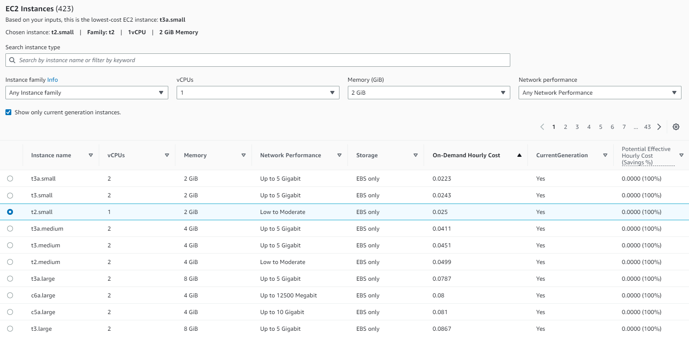
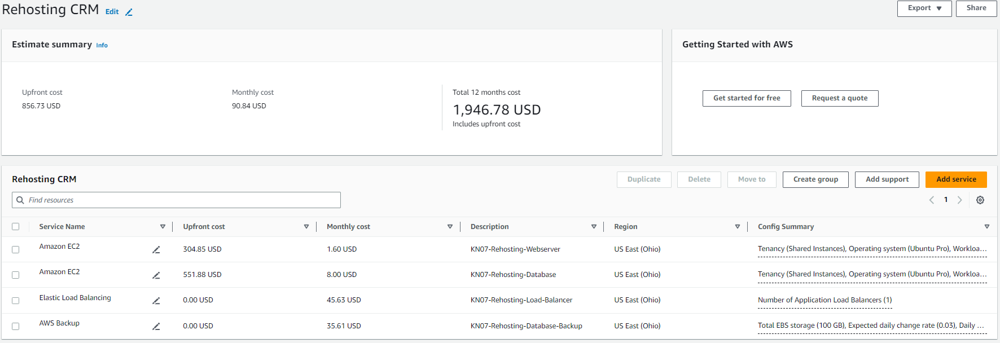

# KN07
[Task Description](./task/KN07.pdf)

## Steps
---

## 1. Rehosting)

In this exercise I will compare the rehosting model prices of AWS vs Azure for a small CRM-Software Company.

### **AWS**

### Database
---
Lets start with the price calculation of our databse.

_For the database I choose a simple EC2 instance. I configure the OS to be `Ubuntu Pro` (normal Ubuntu doesn't exist). Then I select `2 virtual CPUs` and `4 GiB RAM`._

_My configuration is used as a filter and from the displayed instances I choose the `t2.medium`._

_Now for the storage I choose a warm `EBS`. The database needs `100GB storage` so that is what I configure. I do not use the snapshot feature because later on I will create a backup service._

_Now for the Backup. Again I select `EBS` because thats where our backup will be stored. For the backup frequency I choose `daily 7 days`, `weekly 1 month`, `monthly 3 months` (like in the [task](./task/KN07.pdf) described)._

### Web Server
---
Now that we have our estimated pricing for the database lets continue with the web server.

_Of course I also use an `EC2` service for the web server. The difference to the database here is the amount of cpu and ram we need. I use `1 virtual CPU` and `2 GiB of RAM` for the filter._

_Instead of t2.medium the `t2.small` option is enough for our web server so that's what I will choose._

_Now for the storage. Because the task explicitly mentions 20 GB of storage I assume that the web server also needs some `warm EBS` storage. So I configure a `20 GB` storage._

### Load Balancer
---

Now for the last step, let's claculate the load balancer pricing.

_I choose an Application Load Balancer. For the GB per hour I had some difficulties because I don't have information of the size of the application or customers. So my assuption will be `5 GB data traffic per hour`. To compare I will also use this value for the Azure option later on._

### Summary
---

_Amazon offers a one time payment plus monthly costs. In the screenshot below there is an overview of the cost of all the services I configured._

### **Azure**

### Database
---

_For the database service of Azure I select the Azure SQL Database. Similar to AWS I also use `2 virtual cores` and a pay as you go sql license._

_I am also able to calculate the cost of the Database Storage. For the Backup size I choose `50 GB` (average of max storage `100 GB`). Backups can be calculated very easily in Azure. I choose the same backup periods as with AWS (see image below)._

### Web Server
---

_For the web server I choose a VM with `1 vCPU`, `2 GB of RAM` and `4 GB` of hot storage. For the disk size I choose `128 GiB` because it is the closest to `100 GB` there is._

### Load Balancer
---

_Last but now least let's have a look at the Load Balancer. I estimated 5 Rules because that seems reasonable for a basic application. The data that is being processed was a bit tricky like with AWS because there are no defined requirements. To make the comparison as expressive as possible I choose `5 GB` (like I did with the Load Balancer in AWS)._ 

### Summary

_Different to AWS, Azure doesn't have an upfront payment. But the monthly costs are also mcuh higher than with AWS._

I think when it comes to Ubuntu machines AWS is the cheeper option. If I want to run a Windows system it would propably be a better option to use Azure because in AWS the windows licence needs to be aquired seperately.

## 2. Replatforming)

For the next step I will have a look at the replatforming options the company has. `Heroku` will be chosen as the cloud provider. 

_In the screenshot below you can see the cost overview for heroku. For the Database I choose a `Standard 0 Postgres` service and for the web server the `Standard 1X` and only one instance. It would probably make sense to use more than one instance (every instance costs an additional amout of 25$). All together I get a monthly cost of 75$, which is way cheeper than Rehosting._

## 3. Repurchasing)

When repurchasing the application we dump the whole code and all the work of the poor developers in a trashcan and use another companies application. 

In this case we have two options for a CRM System: `Zoho CRM` and `SalesForce Sales Cloud`.

### **Zoho CRM**

